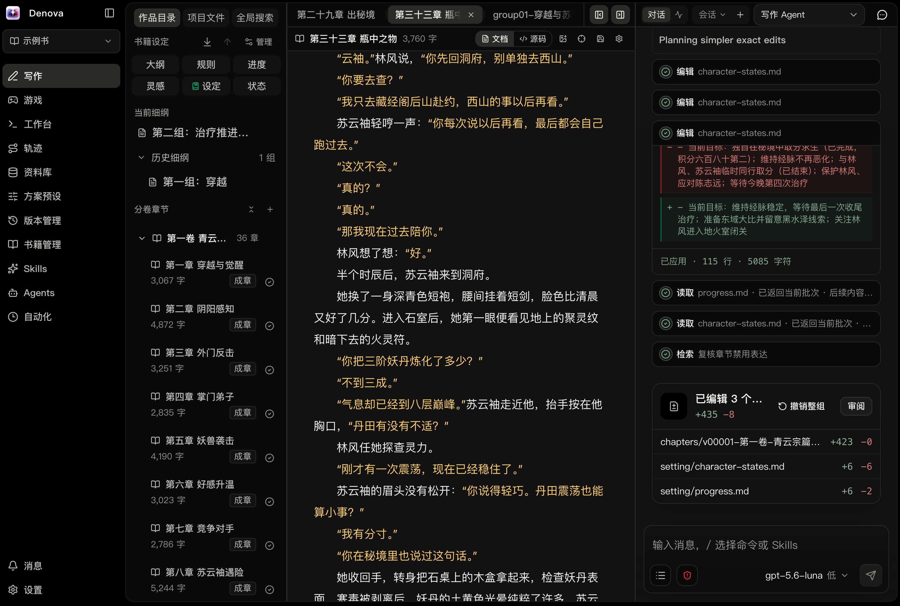
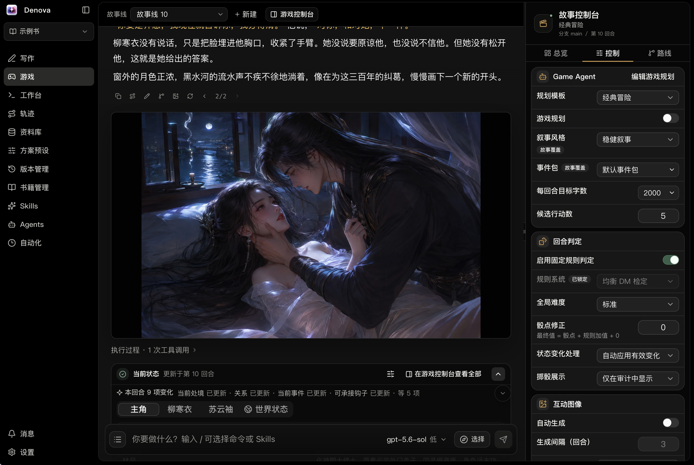
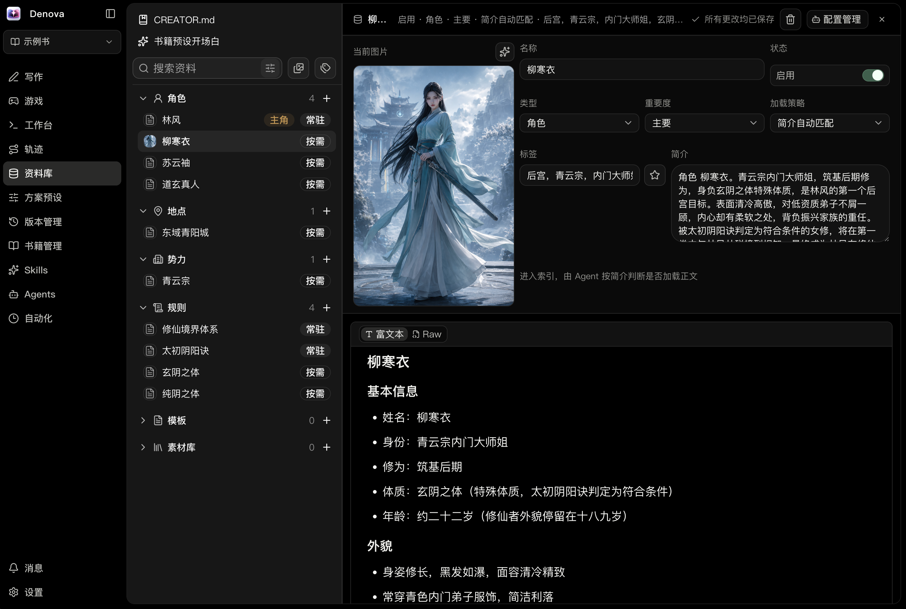
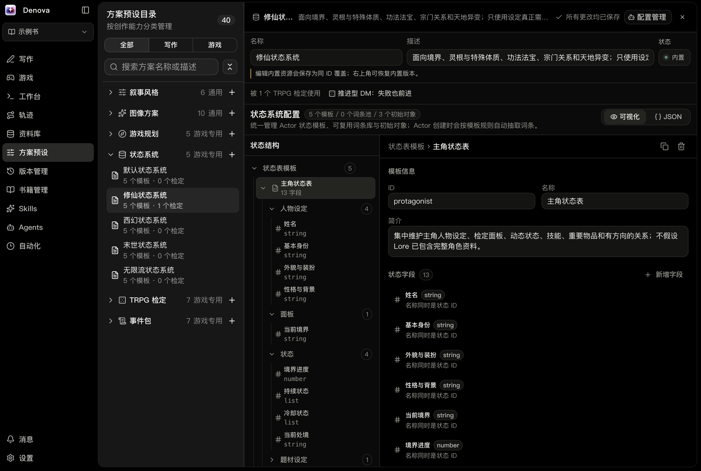
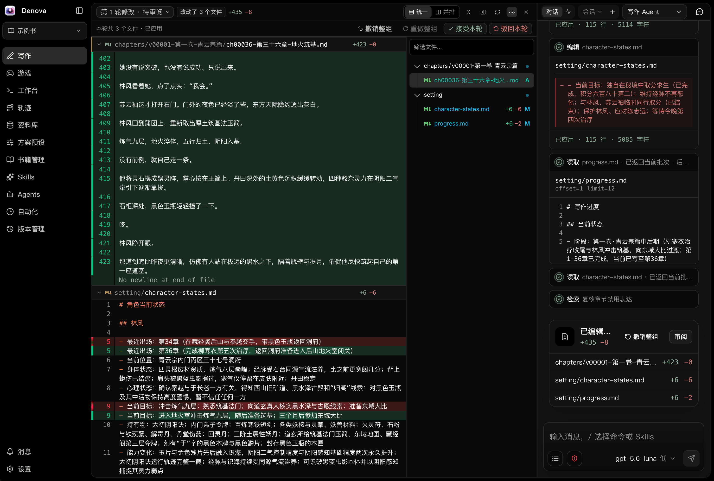
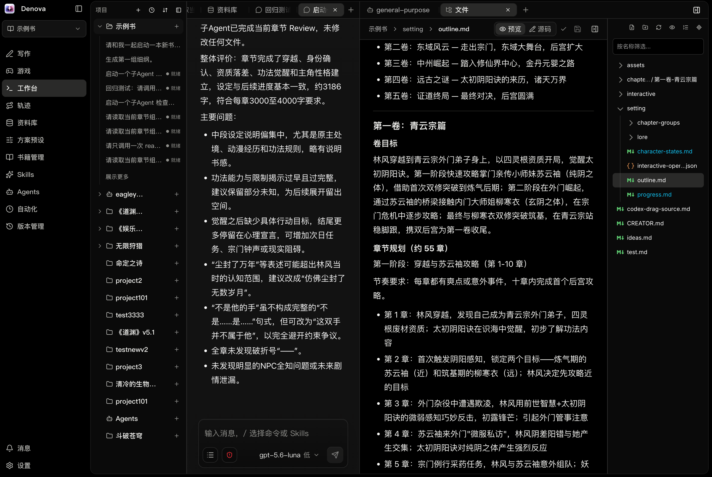
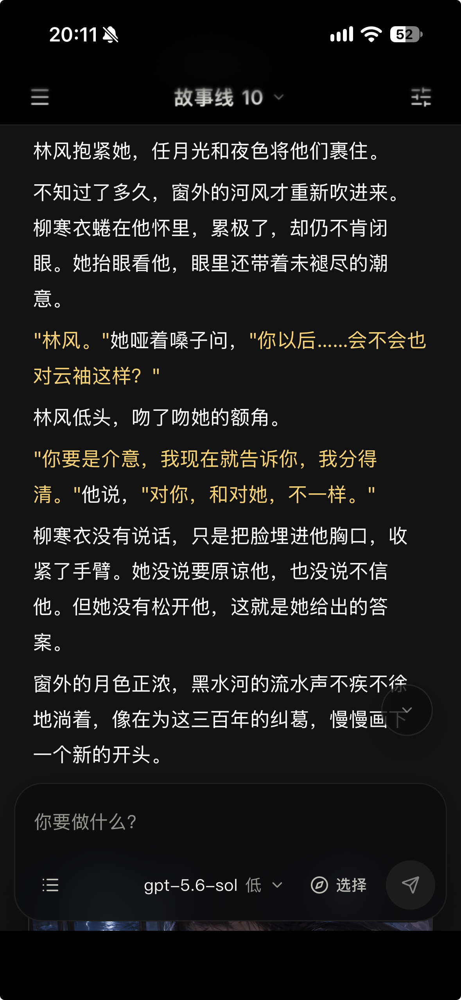

<p align="center">
  
</p>

<p align="center">
  <strong>Denova is an integrated AI creative platform for novel writing and AI role-playing games, with built-in AI Agents, Skills, SubAgent collaboration, automation, image generation, and project version management</strong>
</p>

<p align="center">
  English | <a href="README.md">中文</a>
</p>

<p align="center">
  <a href="https://discord.gg/BM6dRmyvvZ"></a>
  <a href="https://github.com/alfredxw/denova/releases"></a>
  <a href="./LICENSE"></a>
  
  
</p>

<p align="center">
  Current version: <strong>v0.5.1</strong> (2026-09-28) · Beta · <a href="https://github.com/alfredxw/denova/releases">Download the latest release</a>
</p>



<details>
<summary>View more screenshots</summary>

### Game



### Lore Library



### Creative Setups



### Change review



### Workspace



Supports LAN access, responsive mobile layouts, and PWA apps.



</details>

## Why Denova

Denova brings novel writing, interactive stories, structured lore, AI Agents, image generation, automation, and local version management into one workspace. It is designed for creative projects whose settings and content need to evolve over time.

Start a new book from an idea, import an existing novel to continue writing, or use character cards and lore to build a branching text adventure. Agents can read project content, use tools, and edit files while important changes remain reviewable, undoable, and recoverable.

## Core Features

- **Novel writing**: Markdown document and source editing, multiple tabs, find and replace, outlines and chapter plans, progress tracking, inline comments, change review, and novel import.
- **Creative Agents**: choose Native, Codex, or Claude Code to work with selections, project files, images, and lore; extend workflows with Skills, multiple conversations, SubAgent collaboration, and task pause/resume.
- **Interactive games**: advance stories through player input, with branches, storyline switching, action suggestions, character and world state, rule checks, adjustable story planning, and OpenAI-compatible read-aloud.
- **Lore and Creative Setups**: manage characters, locations, factions, world rules, and narrative styles in one place so durable creative assets can serve both Writing and Game.
- **Image creation**: generate chapter illustrations, interactive images, and book covers, then preview and manage the results in the app.
- **Versions and recovery**: save local versions, inspect changes, restore historical files, and review or undo Agent edits to the workspace.
- **Automation**: run scheduled review, continuation, and custom creative tasks.
- **Cross-platform experience**: Chinese and English UI, light and dark themes, Windows / macOS / Linux support, remote access, and installation to a phone's home screen.

## Writing and Game

Writing and Game are peer top-level destinations in the workbench. Writing focuses on ideas, settings, outlines, chapters, and progress. Game focuses on player actions, story branches, character state, and storyline progression.

Lore, Creative Setups, Skills, and version management are shared between the two workflows. Chapter progress and game state remain separate so temporary state from one destination does not affect the other.

## Quick Start

### Install a Release

macOS / Linux users can run the installer:

```bash
curl -fsSL https://raw.githubusercontent.com/alfredxw/denova/master/scripts/install.sh | sh
```

Run `denova` after installation. Windows users and anyone who prefers manual installation can download the archive for their platform from [GitHub Releases](https://github.com/alfredxw/denova/releases); on Windows, run `denova.exe`.

For stable use, choose a Release. The `master` branch may contain unreleased changes.

Before upgrading from v0.4.5, read the [v0.5.0 release and data compatibility notes](./CHANGELOG.md). Journals are backed up before their first upgraded write, but older versions cannot read the new task recovery, compaction, and external runtime records. To downgrade, stop the app, restore the earliest pre-upgrade backup, and separately preserve content created after upgrading.

### First Run

1. Follow the startup guide to add a language-model API key and model name.
2. Create or import a book, or open an existing project directory.
3. Start creating from Writing, or create an interactive storyline from Game. Configure an image model only when you need image generation.

### Run from Source

You need Go 1.26.6+, Node.js 22.13+, pnpm, ripgrep, and Bash. On Windows, run these commands from Git Bash or WSL.

```bash
git clone https://github.com/alfredxw/denova.git
cd denova
corepack enable
./scripts/bootstrap.sh
```

Default addresses:

- Frontend: `http://localhost:5173`
- Backend: `http://localhost:8080`

## Models and Configuration

The recommended setup is through Settings: add a provider connection, select or enter a model, and test the connection. One connection can be reused by multiple models. Language models support built-in providers and custom API-compatible endpoints. Image models support OpenAI, xAI/Grok, Volcengine Seedream, Google Gemini Image, ComfyUI Workflow, and custom endpoints.

## Remote Access and Phone Usage

Enable LAN access under **Settings → Access**, set a username and password, and restart. Other devices can sign in at the displayed address. The host can also create a one-use sign-in QR code and link that expire after 5 minutes. Scan with a phone on the same LAN, or copy the link to another device. The browser stays signed in for 30 days across refreshes and server restarts; sign out from Settings. Phone browsers can add Denova to the home screen.

When running from source, QR codes and connection links use the backend port to serve the `web/dist` build. Run `pnpm --dir web build` and restart the backend before first use or after frontend changes. The local Vite entry point remains available for development with hot reload.

For public or domain-based deployments, put Denova behind an HTTPS reverse proxy such as Caddy or Nginx so login credentials are not transmitted in cleartext.

## Development

Read [CONTRIBUTING.md](./CONTRIBUTING.md) before contributing. Common commands:

```bash
./scripts/bootstrap.sh fe
./scripts/bootstrap.sh be
./scripts/build.sh
```

## Community

Denova is evolving quickly. Bug reports, workflow ideas, usage notes, and creative discussions are welcome.

[Discord community](https://discord.gg/BM6dRmyvvZ)

<p align="center">
  
</p>

## Support Denova

> Help Denova keep improving and remain open source. Thank you for your support!

<p align="center">
  
</p>

## License

[Apache-2.0](./LICENSE)
