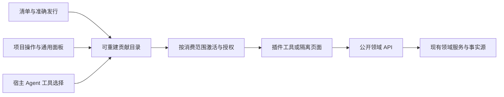

# Denova v0.6.0 插件系统完整交付方案

状态：v0.6.0 功能已在工作区实现，发布验收以文末记录为准。更新：2026-10-01。代码审计基线：`7f7c5881`。

本文定义 v0.6.0 插件平台应完整交付的场景、公共边界与验收条件，不是分期路线图。本文列入交付范围的能力均为本版要求，不能以示例、开发预览或部分接口代替正式可用功能。当前实现说明见[平台设计](plugin-platform-design.md)、[HTTP API](plugin-platform-api.md)和[扩展设置](extension-settings.md)；本文声明的字段与生命周期已经落入实现；精确字段以运行实例 OpenAPI 和开发手册为准。

代码、测试和 `AGENTS.md` 的长期不变量优先。本文保留设计取舍、验收标准与实现验证记录，不作为未来分期路线图。

## 1. 结论

**v0.6.0 交付一个以工具、命令、独立界面和现有领域 API 为基础的插件平台。** 工具型、界面型、工具与界面组合型插件都必须正式可用。自定义游戏继续作为独立产品身份，共享平台基础并保留自己的存档生命周期。

设计核心是：宿主提供少量语义明确、可组合的能力，负责发现、授权、作用域和资源释放；插件通过公开契约完成自己的业务。插件不依赖宿主内部组件，宿主也不认识人物关系图、素材看板或某种玩法的专属数据结构。

**文档写回与编辑器扩展不在本版范围。** 不提供当前正文、选区、光标、编辑器菜单、诊断装饰、自动补全、修改建议采纳或正文替换接口。用户可以向插件输入或粘贴文本，再自行复制结果。现有资料库写入、插件自有内容保存和 Game 的 Story 操作继续支持，它们不是通用正文写回。

高扩展性的判定是：新增使用现有公开能力的插件，只需新增扩展包；新增一种宿主能力，只需扩展对应领域接口及其适配，不要求修改无关插件或基础执行体系。

## 2. 方案对比与设计依据

| 选择 | 实际收益与长期负担 | 结论 |
| --- | --- | --- |
| 只保留工具插件与独立游戏 | 改动最少，但普通插件没有完整交互入口；复杂创作工具容易被迫包装成游戏或进入宿主业务代码 | 不满足 v0.6.0 目标 |
| 工具＋命令＋独立面板＋有限领域 API | 工具可由 Agent 或用户调用，复杂交互由插件界面完成；宿主维护少量稳定契约和统一容器 | 采用 |
| 编辑器深度接入、任意界面替换和流程钩子 | 可接管更多宿主行为，但正文一致性、内部组件和执行流程都成为长期兼容负担 | 不进入本版 |

VS Code 可扩展性的关键不是扩展点数量，而是**声明式贡献、宿主调度、公开语义 API、清晰生命周期和稳定契约**。Denova 吸收这些原则，不复制完整工作台、语言服务、复杂条件表达式或远程 Extension Host。

| 借鉴点 | Denova 的具体落点 |
| --- | --- |
| 不运行代码也能发现能力 | 清单声明工具、命令和面板；宿主计算入口与可用状态 |
| 宿主决定何时调用 | 按用户操作或 Agent 工具调用激活；宿主管理作用域与取消 |
| 能力通过公共接口组合 | 同一工具可供命令、Agent 和显式依赖者使用；面板调用领域 API |
| 内部重构不破坏扩展 | 不开放 React、DOM、状态仓库、内部管理路由或 Agent 执行循环 |
| 每项资源有所有者 | Project 插件交互、Agent 执行和 Game 实例分别管理生命周期 |
| 公共承诺可控制 | API 主版本＋最低宿主版本；只承诺明确列入公共契约的能力 |

研究依据：[Contribution Points](https://code.visualstudio.com/api/references/contribution-points)、[Commands](https://code.visualstudio.com/api/extension-guides/command)、[Extension Host](https://code.visualstudio.com/api/advanced-topics/extension-host)、[Activation Events](https://code.visualstudio.com/api/references/activation-events)、[Extension Manifest](https://code.visualstudio.com/api/references/extension-manifest)、[扩展能力边界](https://code.visualstudio.com/api/extension-capabilities/overview#restrictions)。对照研究只保留在本文，不进入 Denova 提示词或模型协议。

## 3. 必须遵守的设计标准

1. **简单且完整。** 每个机制都必须服务于本文的实际场景并有验收项；不引入“以后可能需要”的基础设施，也不以缺失生命周期的半成品冒充简单。
2. **一项职责只有一套机制。** 命令复用工具执行，面板复用隔离 view，设置复用现有配置，领域写入复用原服务与 journal；不新建执行引擎、配置数据库或恢复事实源。
3. **类型有限，业务开放。** 宿主认识工具、命令、面板、权限与领域操作；插件实现业务。有限状态穷尽处理，未知类型明确拒绝。
4. **公共协议小且稳定。** 协议描述领域语义，不复制内部结构；SDK 可选，原始 HTTP 具有同等能力。不建设万能 Provider、动态服务图或通用事件总线。
5. **派生信息不持久化。** 菜单、贡献目录、可用状态与活动消费者由现有事实计算；复用已有发行摘要和修订，不增加平台专用 revision/hash。
6. **配置只解决真实控制需求。** 沿用现有全局启停、授权和发行设置，只补项目停用与实际所需的模型选择；不增加逐会话、逐工具开关和多层设置覆盖。
7. **失败不能无界扩散。** 附加插件错误不阻止普通创作；明确依赖失败能力的操作必须失败并显示归属，不能跳过后宣称成功。
8. **独立插件证明边界。** 至少两个不同业务的界面插件和一个组合型插件完成正式安装与使用；不通过批量插件化内置功能来展示架构。

评审一个新增概念时，必须能回答：删掉它，哪个本版验收场景无法正确完成？若没有明确答案，就不加入设计。

## 4. v0.6.0 完整支持的场景与功能

以下范围同时包含应保留的现有能力和必须补齐的能力。“已有基础”不等于已通过本版验收。

| 场景 | 本版用户与作者能做什么 | 实现基础及补齐项 |
| --- | --- | --- |
| S01 工具型插件 | Agent 按场景使用计算、检索、外部服务等工具；其他插件或游戏显式依赖工具/工具集 | 保留 schema、effect、HTTP 调用与依赖固定；补适用场景、项目停用和单插件故障隔离 |
| S02 用户直接操作 | 从项目操作菜单执行文本整理、数据检查等命令，填写参数、查看或复制结果、取消执行，无须先询问模型 | 增加正式命令入口及 schema 表单，复用现有工具执行；开发工具控制台不能代替此入口 |
| S03 纯界面插件 | 打开关系图、资料看板、交互计算器等自定义界面；可只使用静态前端与已授权宿主 API，无需 Node | 复用 static view、握手与资源 API，补 Plugin 的面板声明、正式打开入口与生命周期 |
| S04 界面与工具组合 | 同一插件提供面板、用户命令及 Agent 工具，共享项目中的插件业务数据；需要时运行 Node 后端 | 贡献可自由组合；复用一个包、已有 backend 协议与项目内容存储，不增加第三种产品身份 |
| S05 AI 与素材工作台 | 插件界面选择已配置的文本/图像模型，提交任务、查看状态、回答模型问题、取消，并保存资料条目、图片及插件自己的数据 | 复用 Agent、图像、资料库和内容 API；补 Plugin 的正式模型配置及缺失配置提示，不只支持预览 |
| S06 自定义游戏 | 完整自定义游戏界面；使用 self 存档或托管 Story；组合共享工具、游戏私有 Agent、图像和资料库 | 保留 Game/Instance、准确发行与依赖、开局配置、saveFormat、Story 分支及恢复规则 |
| S07 作品随附的扩展内容 | 关系图节点、素材板布局、插件上传素材等随 Project 保存和导出/导入；关闭、升级、卸载插件不直接删除作品内容 | 复用 Project Store 内容，补充项目插件内容 ZIP 导出/空目标导入，校验归属、并发修订和可移动引用 |
| S08 开发、分发与维护 | 本地源码校验、构建与预览，已有来源安装与更新、包导出/导入，设置、授权、启停、卸载和故障诊断 | 沿用现有开发与安装链路；命令、界面、模型及版本要求在预览和正式安装中使用同一契约 |

例如，人物关系插件可以读取已授权资料库、显示关系图并保存自己的关系数据；素材工作台可以生成图片、建立素材板并写入自己的内容；文本整理命令处理用户粘贴的文本并返回结果。它们都无需访问编辑器内部，也不需要宿主为某个插件增加业务判断。

### 本版明确不提供的能力

- 所有宿主正文与编辑器扩展：当前文档读取、选区/光标上下文、编辑器菜单、文档修改与采纳、自动补全、诊断、格式化和编辑器组件替换。
- 任意宿主 DOM/CSS 注入、React 组件覆盖、新增全局模式、任意菜单位置与跨插件界面嵌套。
- 通用钩子、提示词/执行流程拦截、插件自定义 planner、通用 Provider 注册框架、后台事件监听平台与可靠事件总线。
- 进程池、热替换、跨项目后台单例、远程 Extension Host、多语言后端框架、依赖多版本求解、插件市场或 OS 沙箱。
- 通过插件重复分发 Skills 或公开用户 Agent；为 Plugin 增加 Game 的私有 Agent 定义体系；为插件自建可写 Todo 或恢复日志。

这些是 v0.6.0 的清晰边界，不是承诺后续一定建设的功能清单。Node 后端仍具有系统账户权限；不提供正文 API 不代表能阻止受信任的本地代码访问文件系统，API 授权不能被描述为 OS 沙箱。

## 5. 推荐方案概要设计

### 5.1 架构与产品身份

| 位置 | 职责与调用约束 |
| --- | --- |
| `internal/platform` | 清单与引用校验、贡献目录、依赖解析、授权、作用域、运行和资源回收；不包含插件业务 |
| `internal/app/platform` | 根据绑定的 Project/Session/Story 连接既有领域服务；负责领域原有提交与恢复约束 |
| `web/src/features/platform` 及已有页面挂载处 | 渲染菜单、命令表单、通用面板、配置与错误；不导入插件组件 |
| `internal/platform/assets/sdk` | 可选的公共协议封装和类型；不掌握宿主内部状态 |

继续只有 Plugin 与 Game 两种包身份。工具型、界面型与组合型只是 Plugin 的贡献组合，不增加 UIPlugin、AppInstance 或新的安装/存储体系。Game 的视图与实例入口保留，不被通用面板取代。

贡献目录扩展已有 Catalog，不建持久化注册表。按贡献职责组织校验、投影与调用，避免把每种业务塞入统一大分发器。新增普通插件不改宿主代码；新增公共领域操作只触及对应协议、权限和适配层。

### 5.2 清单与贡献契约

| 声明 | 本版契约 |
| --- | --- |
| Tool / Toolset | 沿用稳定 ID、JSON Schema、effect、HTTP endpoint、权限和结果校验；工具集继续只是已有工具的组合 |
| Tool 的 `agentContexts` | 可选有限数组，值为 `writing / game / general`，缺省为空；只决定是否自动加入对应宿主 Agent 的工具集合 |
| Command | 稳定 ID、本地化标题、`contexts` 及一个目标；目标仅为调用明确引用的工具，或打开本包声明的面板 |
| Panel | 稳定 ID、本地化标题、`contexts` 和本包既有 `view` 引用；UI 文件仍由既有 static/backend view 承载 |
| 包版本要求 | 保留 `apiMajor`，增加必填 `minHostVersion`；使用语义版本，正式冻结、安装和运行前校验 |

命令与面板声明属于 Plugin 的 `contributes`。Game 保留自己的 view、私有定义和实例入口，不同时注册一套通用面板入口。

`contexts` 为非空有限数组，同样使用 `writing / game / general`。`general` 表示共通工作区及通用对话目的地，是消费场景，不是新的全局模式。未知值在校验时拒绝，不引入任意条件表达式、优先级或参数映射 DSL。

`agentContexts` 为空的工具仍可被命令、面板或已声明依赖者调用；自动暴露不是访问授权。面板出现于游戏目的地也不因此获得 Story 权限。授权、作用域与贡献可见性分别校验。

命令调用工具时复用其输入 schema 和同一执行通道；只有输入确认为有效时才提交。复杂表单、多步操作或自定义结果展示由面板实现，不再增加命令 handler 协议。打开面板的命令只导航，不触发第二个执行实例。

本地引用和 `pluginId/localId` 沿用现有命名与 `requires` 规则。命令可引用本包工具或明确依赖的公开工具；打开面板只允许本包面板。依赖声明只组合已有工具能力，不扩展为跨插件 UI 或动态服务注册。不存在的引用、重复 ID、缺失本地化和未打包文件在冻结发行前拒绝。

### 5.3 界面与命令的正式产品行为

宿主提供一个可复用的通用面板容器，写作、游戏和共通目的地按相同规则挂载。入口限定为已有项目操作菜单与扩展详情中的打开/运行操作；不新增一级导航或编辑器插槽。入口按本地化标题及稳定 ID 确定顺序，不提供插件优先级竞争。

每次打开都必须绑定明确的 Project。当前目的地已有 Project 时沿用该身份；扩展详情打开但没有目标时先选择 Project。宿主容器持续显示插件名称和目标项目。普通面板不自动绑定前台会话、当前正文或正在游玩的 Story。

- 同一 Project、同一插件、同一面板重复打开时聚焦已有页面；不同面板可共享该项目中的插件运行。
- 页面保留自己的路由、临时交互与业务布局；宿主负责加载、错误、重试、关闭及停止入口，保留现有 iframe 来源与握手检查。
- 语言、主题沿用已有握手/页面消息协议；后续变化通知已打开页面。宿主不为此建立通用领域事件订阅，业务数据在打开、执行后或用户刷新时重新读取。
- 项目切换不更换旧页面凭证；保留的页面仍显示原项目，打开新项目产生独立绑定。隐藏面板不等于停止；重启应用不自动恢复后台执行。
- 关闭存在未完成任务或未保存页面状态的面板时有统一退出保护。页面通过有限的忙碌/未保存状态消息参与关闭检查；关闭后取消该页面拥有的宿主任务并释放连接，不等待插件无限阻塞。
- 静态面板没有 Node 依赖。依赖 Node 的包在启动前检查运行版本；缺失运行环境只影响相关插件，并给出可定位提示。

命令使用已有 schema 表单组件收集用户输入，展示执行中、结果、失败和取消状态；文本及结构化结果可查看、复制。只要求宿主显示真实可得的进度，不为普通 HTTP 工具另建进度协议。命令失败保留输入以便用户明确重试，不自动重放可能有副作用的调用。

所有用户可见标题、设置、错误和空状态提供独立中英文资源，随当前语言单语展示。面板处理明暗主题、宽窄屏、长标题和空数据；列表整项可点击展开。插件可自选前端技术，宿主不承诺第三方插件的内部组件兼容性。

### 5.4 激活、运行与故障范围

发现贡献、展示目录和准备工具 schema 不运行插件代码。首次实际调用工具或打开面板才激活；使用冻结发行、已校验配置、已授予权限及准确依赖图。

| 消费者 | 所有权和释放规则 |
| --- | --- |
| Project 中的面板和用户命令 | 复用现有 Project 作用域激活，同一插件和 Project 共享一个活动运行；每个页面/在途命令持有内存中的使用引用，最后一个释放时停止 |
| 宿主 Agent 工具 | 继续归本次 Agent 执行所有，保留 Session 或 Story 分支作用域；进程按调用需要启动，执行结束或取消时释放 |
| Game 及其依赖 | 归游戏实例的活动运行所有，固定实例发行、依赖、开局配置和模型；沿用停止、分支与恢复规则 |

这些使用引用只解决现有 runtime 的所有权，不创建持久会话表、租约数据库或进程池。关闭一个面板不能停止其他面板或独立命令；显式停止该插件项目运行会取消其全部消费者并显示状态。运行停止后凭证失效，不能借旧连接重新启动任务。

活动运行内发行、设置和模型绑定不变；更新后已打开面板显示需关闭重开或显式重启，新 Agent 执行采用新绑定。游戏继续遵循准确发行固定规则。不能在活动进程中替换代码，也不能因设置变化隐式中断无关工作。

全局停用、项目停用、撤销权限或卸载使相关运行失效并释放资源，按既有退出保护处理；授权撤销后旧连接不得继续提交。依赖者同样受提供方停用与授权约束，不能通过依赖绕过限制。游戏停用必需依赖时阻止继续执行并保留存档，不静默替换依赖。

目录损坏、清单/设置错误、缺模型、依赖缺失、启动失败或进程退出，应定位到包、发行、范围、操作和原因。单个可识别的坏包不阻断整个目录或普通 Agent 工具准备；依赖者明确不可用，无关插件继续工作。必需依赖冲突影响对应消费图，不做多版本求解或静默降级。

工具暴露顺序稳定，一次执行中的工具集合与配置不变，保护模型缓存前缀。恢复暂停执行仍检查行为绑定，不偷偷换发行重放工具；第三方副作用无法确认时返回结果未知，不声称取消等于撤销外部操作。

### 5.5 用户配置、模型与 Agent 边界

沿用全局安装状态、授权和按发行保存的插件设置。新增项目配置仅放入既有 Project Store 的 `config.toml`：

| 配置 | 默认与含义 | 生效时机 |
| --- | --- | --- |
| `extensions.disabled_plugins` | 空 ID 列表；禁止本项目使用指定插件，包括通过依赖使用；不能覆盖全局停用或授权 | 保存后使本项目相关运行失效 |
| `extensions.models` | 空映射；沿用模型需求 key 到用户 profile ID 的映射，包含 `pluginId/slotId` 和需要时的 `builtin/assistant` | 新的项目插件激活；活动运行需显式重启 |

项目模型映射是绑定选择，不保存密钥、headers 或 provider 配置，也不复制发行设置。配置界面列出插件及依赖的实际模型需求；必需绑定缺失时只阻止相关操作，提供配置入口。可选图像或助手能力未配置时，纯浏览/计算功能仍可使用，实际调用返回明确的未配置错误。

Plugin 的文本助手继续使用 `builtin/assistant`，不另建文本调用协议。声明 `agents.run` 时，正式配置中必须显示该助手模型；权限声明为必需时要求完成选择，声明为可选时只在实际使用该能力前要求选择。Plugin 的自定义模型槽用于 image 能力，避免提供无法消费的文本槽。Game 的私有 Agent、局部模型槽及实例模型选择保持现有规则，不把私有 Agent 定义移植到 Plugin。

宿主 Agent 调用插件时，`builtin/assistant` 沿用调用方已选文本 profile；插件图像槽读取项目绑定。项目面板/命令没有调用方 Agent，使用项目中明确选择的绑定。Game 使用实例保存的绑定。开发预览使用本次显式输入的临时绑定，不污染正式配置。

宿主 Agent 的工具适配走现有应用层公共能力管线；Native 与已接入的外部 runtime 通过各自现有工具通道消费相同的可用工具，不另建插件专用适配。外部 runtime 的控制仍属于 `internal/agents/runtime`，不进入 `agent/`。插件调用的公开 Agent 服务沿用现有实现，不增加从插件切换任意 Agent runtime 的接口。

模型任务支持状态查询、已有 SSE、普通问题回答与取消，不设新的总时长或迭代上限。模型问题回答不是权限批准。插件不得接管当前写作/聊天会话；服务创建的会话遵守现有所有权和 canonical journal。Game 的 UI、API 和执行层始终禁止 Goal。

### 5.6 公开领域能力与写入边界

| 能力 | v0.6.0 支持范围 | 明确边界 |
| --- | --- | --- |
| 工具 | 已声明本包工具及显式依赖工具/工具集 | 输入、结果、effect、授权仍通过同一服务校验 |
| 资料库 | 绑定 Project 中已授权条目的分页查询、读取及既有写入 | 不自动向模型注入整库，不扩展到其他项目 |
| 图片与素材 | 用户模型槽生成、已支持素材上传/读取、返回稳定资源引用 | 不泄露模型凭证；不把 blob URL 或绝对路径写入作品 |
| 插件自有内容 | 既有项目扩展内容 API 下的 JSON 文档、布局、关系数据与素材 | `document` 在该 API 中指插件自有数据，不是宿主正文；沿用现有并发修订 |
| Agent | 自有范围的会话、执行、状态/事件、问题回答和取消 | 不取得其他产品会话；不创建第二套 journal |
| Story | 仅明确绑定的托管 Game 及被授权依赖使用既有快照、推进、分支、版本和记录 API | Project 普通插件面板和普通 Agent 工具不能因此取得整条 Story 控制权 |

每次请求都校验包、发行、权限、绑定范围和撤销状态，不能以菜单隐藏代替鉴权。请求 body 不能切换 Project/Session/Story/实例；当前能力须区分“宿主未实现”“未授权”“范围不适用”和“未配置”。

正式写入继续由对应领域服务处理并发、去重与恢复。已有可查询领域操作在响应丢失后按原命令标识查询；没有恢复协议的第三方工具明确报告未知结果，由用户决定后续操作，不自动重试。

沿用各接口现有容量限制并在 OpenAPI 标注，列表分页、大资源按既有资源接口读取，超限明确拒绝，不静默截断再提交。模型输入由插件明确构建，不能隐式注入当前正文、整库或宿主系统提示词；平台模型可见协议保持英文。用户主动输入的内容保留原语言。

### 5.7 公共契约与开发维护

公共 DTO、OpenAPI 与清单 schema 同步维护；提供与它们一致的类型和小型外部样例，SDK 只是便捷封装。预览、安装与运行使用同一套清单/权限/作用域校验；预览明确显示所选测试 Project，领域写入仍遵循该目标与授权，不暗中覆盖其他项目或正式游戏存档。临时发行和模型绑定与正式安装状态分开，不为预览建立另一套数据沙箱。

`apiMajor` 表示公共契约主版本，同一主版本保持已发布语义；`minHostVersion` 声明实际需要的宿主能力。开发包同样受版本与授权检查，不新增正式发布所依赖的实验 API 机制。内部管理接口从来不属于插件契约。

版本要求在安装前及激活依赖时检查；比当前宿主更新的包明确拒绝，版本更高不代表允许更多权限。能力目录从实际注册接口及绑定范围生成，不维护第二份手写功能开关表。

复用已有 SemVer、JSON Schema、RJSF、iframe 和进程管理依赖，不引入插件框架包或容器运行平台。文档明确 Node 的最低支持版本，启动时验证；单包日志可定位，禁止输出 bearer、模型密钥等凭证。

## 6. 数据存储与最近 Release 兼容性

| 数据 | 唯一归属和规则 |
| --- | --- |
| 包、准确发行、安装和授权状态 | 既有 `plugins/`、`games/` 布局及 `installed.json`；发行包不可变，目录由记录重建 |
| 插件设置 | 既有 `settings/<releaseId>/settings.toml`；默认来自发行，不新增项目覆盖层 |
| 项目停用与模型绑定 | `stores/<store_dir>/config.toml` 的上述字段；缺省值不要求批量改写旧项目 |
| 随作品保存的插件内容 | 既有 `stores/<store_dir>/extensions/<pluginId>/content/`；共用项目内容 API，经项目插件内容 ZIP 导出/导入；完整目录搬迁保留身份 |
| 插件私有工作数据 | 既有按作用域隔离的 `plugins/<pluginId>/data/<scopeId>/`；不能把需随作品携带的唯一业务数据只保存在这里 |
| 游戏实例与恢复事实 | self 游戏沿用实例自管存档；Story 游戏沿用 Story 记录；保留 saveFormat、固定发行和升级备份 |
| Agent 与产品恢复事实 | 既有 Product Session/Story canonical journal；索引、插件状态和 SSE 都不是第二份恢复源 |
| 面板状态、使用引用、贡献目录、连接 | 运行时数据或可重建投影，不持久化 bearer、端口、blob URL 或宿主绝对路径 |

同一插件的面板与 Agent 工具可能运行在不同 scope；需要共同使用的业务数据经项目内容 API 共享，不通过进程内全局变量或混用私有 data 目录。并发写入复用该 API 的现有修订检查，冲突应重新读取或提示，不能盲目覆盖。

插件作者负责自有数据的格式识别与转换；不兼容时明确拒绝。确需改变用户内容时先备份，失败可恢复，不建设通用迁移引擎。卸载包保留作品内容和已有存档；包导出不夹带运行凭证、私有配置或用户存档，项目插件内容导出显式携带该插件 JSON 和媒体；现有书籍 TXT、资源包和游戏存档导出不会自动变成整项目导出。

所有受管内容继续使用稳定 ProjectID、不可变 `store_dir` 和规范相对路径。移动 `.denova`、项目改名或重新关联 External Project 不能产生新的作品身份或第二份事实源。

最近正式 Release 基线为 [v0.5.1](https://github.com/alfredxw/denova/releases/tag/v0.5.1)，该 tag 尚无当前 `internal/platform` 与 `internal/platform/assets`。不维护未发布清单、API 或内部数据中间格式的兼容。本方案不改变 v0.5.1 作品正文与 journal 格式，因此不预设用户内容迁移。

实施若发现确需改变最近 Release 的用户数据，必须列出具体字段/路径、先备份的前向转换和失败重试办法；不得顺带重分配 Store、增加双写或通用路径兼容层。

## 7. 改动范围、风险与持续收益

### 7.1 改动范围

| 模块 | 必须完成的改动 | 风险边界 |
| --- | --- | --- |
| 清单、Catalog、依赖 | 命令/面板、场景和最低版本校验；可用性与单包诊断 | 中：影响发现与准入，应集中在平台层，不改依赖存储模型 |
| 激活与工具准备 | Project 消费者释放、面板定位、工具按场景筛选、配置与依赖故障隔离 | 中高：涉及进程、撤权、取消和恢复，需集成测试 |
| 前端正式入口 | 项目操作菜单、通用面板、命令表单、模型配置和错误处理；复用 Game view 基础 | 中：跨写作、游戏、共通目的地，但不触及编辑器内部 |
| 配置、资料与导出适配 | 新增少量项目字段，打通插件自有内容与模型绑定，核对作品导出 | 中：保护已有数据与路径不变量，不新建存储体系 |
| 公共契约、样例与验证 | schema、OpenAPI、类型、开发文档、独立插件和跨平台验收同步 | 必需维护成本，不能只完成运行代码而留下不同版本的契约 |

这是平台层与挂载入口的集中改造，不是整套应用重写。移除正文编辑后，主要风险集中到共享运行的释放、权限撤销、模型绑定和公开契约；不再承担编辑器脏状态、位置映射、格式保真与正文采纳冲突的新增负担。

### 7.2 维护责任与实际收益

宿主长期承担：公共协议兼容、安装与授权、作用域和进程生命周期、领域 API 正确性、共享 UI 容器、参考插件契约测试。插件作者承担：业务交互、领域算法、第三方服务适配、自有数据格式与迁移、页面性能和自身界面质量。

收益来自把独立创作工具从宿主业务迭代中移出：资料可视化、素材管理、专用生成和游戏玩法可以独立更新；同一工具通过 Agent、命令和面板复用；宿主内部组件可以重构而不逐个修插件。没有插件时，核心写作、游戏和通用对话仍独立成立。

收益有边界：新插件需要平台从未公开的领域操作时，仍要修改宿主；第三方质量问题和公共 API 兼容也会产生支持成本。不能把“插件可扩展”解释为宿主以后无需开发或维护。

控制长期负担的硬约束：

- 不以特定插件 ID、人物类型或玩法创建宿主分支；两个不同业务插件验证同一边界，无需新增挂载位置。
- 不为了插件搬迁全部内置功能；不引入另一套执行、状态、配置或迁移机制。
- 公共 API 变化必须同步契约与代表性端到端验证；测试覆盖不同能力和生命周期，不枚举所有插件组合。
- 新领域 API 必须说明真实用途、数据归属、权限和失败语义；普通页面交互优先留在插件内部。
- 开发者能只凭公开文档完成安装与使用；如果必须导入宿主源码、借内部路由或要求宿主修改业务代码，应视为边界未完成。

这些约束通过验收执行，不增加遥测平台、复杂治理流程或阶段性批准制度。

## 8. v0.6.0 验收事项

以下全部是本版交付要求；具体通过证据与未验证范围见第 9 节。验收记录逐项填写通过/失败/未验证、证据与实际平台；开发预览通过不能代替正式安装通过。

### 8.1 支持场景必须端到端成立

| 编号 | 验收场景 | 通过标准 |
| --- | --- | --- |
| E01 | S01 工具型插件 | 按场景进入宿主 Agent 工具集合，执行与取消有效；显式依赖可使用未自动暴露的工具；通过现有 Native/外部工具适配验证一致授权 |
| E02 | S02 文本整理命令 | 正式菜单打开 schema 表单，处理用户粘贴文本，显示/复制结果和错误；无须模型；不读取选区或写入宿主正文 |
| E03 | S03 纯前端关系图 | 没有 Node 时仍可正式打开；在已授权 Project 读取资料并保存插件自己的关系数据，关闭重开可恢复 |
| E04 | S04 组合型插件 | 同一包提供工具、命令和面板；面板与 Agent 通过项目内容 API 使用同一业务数据，跨 scope 不丢失或盲目覆盖 |
| E05 | S05 素材工作台 | 正式配置模型后调用文本助手和图像能力，查询/取消任务、回答问题、保存素材；未配置可选模型不妨碍浏览；不暴露密钥 |
| E06 | S06 自定义游戏 | self 与 Story 两种游戏都完成开始、继续、停止及恢复；Story 分支/版本、固定发行与依赖仍正确，任何入口都不能启用 Goal |
| E07 | S07 作品内容 | 插件 JSON/媒体经项目内容 ZIP 导出/空目标导入后可恢复；完整 .denova 搬迁保留 ProjectID/store_dir，升级/卸载不删除内容，导入不改目标项目身份 |
| E08 | S08 开发与分发 | 工具型、界面型和组合型包均完成校验、预览、正式安装、配置、更新、启停、卸载与包导出/导入；运行旧发行不被暗中替换 |

### 8.2 正确性、隔离和维护边界

| 编号 | 验收场景 | 通过标准 |
| --- | --- | --- |
| C01 | 贡献发现及无插件状态 | 浏览目录、菜单及准备工具 schema 时启动进程数为零；无插件时核心写作、游戏、通用对话正常 |
| C02 | 场景、启停与依赖 | 自动工具仅包含适用项且顺序稳定；项目停用不影响其他项目；依赖不得绕过停用，必需依赖失效明确阻止相关执行 |
| C03 | 单插件故障 | 损坏安装记录/设置、缺依赖、缺模型、后端崩溃分别复现；无关目录、普通 Agent、内置游戏及其他插件仍可使用 |
| C04 | 身份和授权攻击 | A 项目面板切换到 B 后旧请求仍仅绑定 A；伪造 body、来源、跨 Session/Story/实例请求及撤权后请求均被拒绝 |
| C05 | 多页面和命令的运行所有权 | 重复打开同一面板聚焦；关闭一个消费者不停止其他消费者；最后一个释放后无残留进程/连接；隐藏不取消 |
| C06 | 关闭、撤权与崩溃 | 未完成任务/未保存状态有退出保护；确认关闭、停止、撤权和进程退出回收正确；已停止运行的旧凭证不能重新发起工作 |
| C07 | 配置、模型与更新 | 缺少必需选择有正式配置入口；修改绑定不热换活动运行；Agent 下一次执行读取新配置；游戏使用原实例绑定 |
| C08 | 并发和不确定结果 | 共享内容冲突不覆盖；领域重复请求沿用既有去重/查询；第三方未知副作用不自动重试、不宣称已撤销 |
| C09 | 版本与契约错误 | 未知场景/引用、缺本地化、遗漏分发文件、API 主版本或最低宿主版本不满足，均在运行插件代码前拒绝 |
| C10 | 能力与执行边界 | 未实现、未授权、范围不适用、未配置可区分；普通面板无托管 Story 权限；不隐式切换 Agent runtime |
| C11 | 运行恢复 | 暂停工具调用遇到不兼容绑定明确拒绝恢复；Game 继续固定准确发行；Agent/Story 各有唯一 canonical journal |
| C12 | 数据格式和可移动性 | 不兼容插件数据明确拒绝，转换先备份且失败可恢复；持久引用无凭证/绝对路径，导出包不泄露配置和存档 |
| C13 | UI 质量 | 写作、游戏、共通入口均验证中英文、明暗主题、宽窄屏、长文本、空数据和错误；唯一一级菜单高亮、列表整项展开 |
| C14 | 独立性与业务增量 | 关系图与素材工作台至少两个不同业务插件只依赖公共契约；其中至少一个从仓库外目录构建/安装，新增包不修改宿主业务代码 |
| C15 | 宿主内部演进 | 调整宿主内部 UI/适配实现后参考插件契约测试仍通过；没有内部组件/管理路由依赖，没有重复执行/配置/恢复体系 |
| C16 | 本版边界 | 清单、SDK、OpenAPI、菜单和样例均无正文/编辑器接入承诺；插件自有内容与既有资料库、Story 写入仍正常 |

### 8.3 检查范围与完成判定

- 清单与场景解析用单元测试；故障隔离、授权、消费者生命周期、共享数据、配置、取消和恢复用集成测试。复用既有 fixtures，不增加生产代码专用测试入口。
- 跨包和持久化实施覆盖相关 Go module 的 `go test ./...`、`go vet ./...`；全量与发布覆盖根目录、`agent/` 两个 module。
- 前端按改动运行 `pnpm --dir web test:unit`、`test:browser`、`test:e2e`、`check:i18n`，命令以 `web/package.json` 为准；必须打开页面验证上述正式流程及 C13。
- 进程、路径、安装、更新和发布验证覆盖 Windows 原生、macOS、Linux；WSL 结果单列，交叉编译不能代替目标系统运行。未验证项如实记录，不能算通过。
- 发布前完成包含主程序、updater、前端及内嵌资源、Skills 和 ripgrep 的完整构建。本文本身的编辑仅做文档静态检查，不运行程序测试或构建。
- E01–E08、C01–C16 全部有通过证据，且公开文档/类型/schema 与实现一致，才能宣布 v0.6.0 插件系统完成；不能把命令或界面留在开发模式，也不能以路线图替代未实现项。

交付结果应当是：独立作者能实现并发布这些插件，用户能完整配置、使用和停用它们，单插件故障不破坏普通创作，宿主为此只增加少量长期稳定的公共契约。

## 9. 工作区实现与验收记录（2026-10-01）

本节记录 2026-10-01 的工作区实现与验收，不代表已经发布 v0.6.0。实际验证环境为 Windows 原生、PowerShell 7、Go 1.26.6、Node 24.15、pnpm 11.24、Chromium。完整打包使用 Git Bash 调用仓库 Windows 发布脚本，不将 Git Bash 记作 WSL 验证。

2026-10-07 整理：关系图与素材工作台演示包已移除，宿主面板与内容流转测试改用通用插件骨架；素材工作台专属 E2E 已删除。下述涉及这两个演示包的验收结果仅作为历史记录，不代表当前仍保留对应回归覆盖。创建模板和 SDK 现位于 `internal/platform/assets`。

### 9.1 实现结果

- 清单声明 Agent 场景、用户命令和面板；目录只读取冻结发行，执行时才启动后端。命令复用工具 schema，面板复用既有 iframe、握手和关闭保护。
- 写作、游戏、通用工作台和扩展详情均有正式入口。页面绑定显式 Project，同项目同面板重复打开聚焦；切换产品目的地、收起面板不改变绑定。
- 同插件和 Project 共用激活，每个消费者拥有独立凭证和取消范围；最后一个消费者释放后停止运行。Agent 工具保持原来的执行范围，游戏保持实例范围。
- 项目停用和模型绑定写入既有 Project 配置；权限、发行、依赖和设置采用运行快照。重新授权和停用立即撤销受影响运行，其他项目的项目级设置保持独立。
- 项目 JSON/媒体复用既有内容 API，新增同插件内容 ZIP 导出与空目标导入。没有增加正文写回、编辑器扩展、第二套执行器或恢复 journal。
- 两个独立界面示例、组合型开发骨架、SDK 类型、OpenAPI 和开发文档同步交付。纯静态面板不依赖 Node；有后端的包要求 Node 22 或以上。

实现入口见 [贡献发现与准入](../internal/platform/plugin_contributions.go)、[消费者生命周期](../internal/platform/runtime_consumers.go)、[项目配置](../internal/platform/project_configuration.go)、[公共能力](../internal/platform/capabilities.go)、[内容导入导出](../internal/platform/project_content_archive.go) 和 [正式面板容器](../web/src/features/platform/PluginWorkspace.tsx)。当前开发骨架与参考实现见[插件开发手册](plugin-developer-guide.md)。

### 9.2 逐项证据

“通过”均限定上述 Windows 环境。部分验证项明确列出尚未覆盖的范围，不将 mock、接口测试或交叉编译等同于真实外部程序、其他操作系统或所有 UI 组合的验收。

| 编号 | 结果 | 证据与范围 |
| --- | --- | --- |
| E01 | Native 通过；真实外部 CLI 未验证 | `host_tools_test.go`、`plugin_isolation_test.go` 与 `conversation-plugins.spec.ts` 覆盖写作、通用、游戏、委派工具、场景筛选、显式依赖、配置变更；已有应用层外部适配测试通过，但本轮未接入真实外部 CLI 执行插件 |
| E02 | 通过 | `plugin-contributions.spec.ts` 经正式安装打开命令表单、输入、执行、显示结果；直接调用工具，不经过模型 |
| E03 | 通过 | 同一 E2E 从仓库外复制并安装关系图，保存、退出保护、收起、重复打开和重开恢复；`TestPluginManifestBoundariesAndStaticViews` 在找不到 Node 的条件下仍可打开静态面板 |
| E04 | 通过 | 同一 E2E 验证组合骨架的命令、面板及独立 Session 工具读取同一草稿；`resources_content_test.go` 验证跨 scope 共享与 revision 冲突 |
| E05 | 通过 | 素材工作台 E2E 配置可选文本/图像模型，完成普通问答（选择与自由文本）、取消运行任务、实际渲染图像、采纳并重开恢复；模型由确定性测试服务提供。平台助手复用 Native `Ask` 工具；`plugin_consumer_tasks_test.go`、`agent_cancel_test.go`、`resources_test.go` 另覆盖消费者取消、任务查询、持久化和不确定结果 |
| E06 | 核心链路通过；既有阅读布局断言失败 | 平台及应用集成测试覆盖实例、停止、恢复、分支和固定发行；`platform.spec.ts` 覆盖正式安装游戏、继续和停用保留存档。现有阅读列对齐测试见 9.3，未修改 Goal 执行边界 |
| E07 | 通过 | `project_content_archive_test.go`、`resources_content_test.go`、`lifecycle_test.go` 验证内容身份、拒绝覆盖、路径与搬迁；正式入口 E2E 下载 ZIP、导入另一空 Project 并恢复内容 |
| E08 | Windows 通过 | `extension_workflow_test.go`、`platform.spec.ts`、`platform-publishing.spec.ts` 和贡献 E2E 覆盖源码、预览、打包、正式安装、配置、更新、停用和保留数据；冻结包导出/导入沿用平台测试 |
| C01 | 通过 | 目录/工具准备测试断言不启动后端；无插件的写作和主导航回归通过 |
| C02 | 通过 | `plugin_isolation_test.go`、`plugin_contributions_test.go` 和项目入口 E2E 验证场景、停用、依赖与项目隔离 |
| C03 | 通过 | 损坏包与设置由 `plugin_isolation_test.go` 隔离；准入覆盖缺依赖/模型；`TestCrashedBackendStopsDependencyProcesses` 覆盖后端崩溃回收 |
| C04 | 通过 | 既有范围授权测试与贡献测试覆盖来源、项目/实例绑定、消费者伪造、释放后的旧凭证；项目入口 E2E 验证切换目的地不换绑 |
| C05 | 通过 | 贡献及消费者任务测试覆盖共享激活、单个释放、最后释放、取消归属；面板 E2E 覆盖重复打开、隐藏和重新打开 |
| C06 | 已覆盖正常关闭、撤权及后端崩溃 | E2E 验证 dirty 退出保护；消费者及生命周期测试验证任务回收和旧凭证失效。浏览器正常卸载尽力释放；未模拟浏览器进程被强杀，不承诺崩溃页面自动恢复 |
| C07 | 通过 | `configuration_test.go`、`host_tools_test.go`、贡献测试覆盖冻结绑定、下一轮采用新配置和配置 revision；正式 UI 完成模型选择与项目停用 |
| C08 | 通过 | `resources_content_test.go`、图像请求测试及 Agent 取消测试覆盖冲突、幂等回放、查询和不确定结果不重提 |
| C09 | 通过 | 清单、贡献、配置、包检查测试覆盖版本、场景、引用、双语字段、分发文件和表单 schema；错误发生在启动代码前 |
| C10 | 通过 | 公共 `/capabilities` 分开报告 implemented/granted/applicable/configured；资源、范围和贡献测试覆盖权限及未配置，不改 Native runtime 分层 |
| C11 | 通过 | `TestPausedPluginTaskRejectsChangedSharedSettingsAfterReopen`、实例/恢复和应用层集成测试；未增加插件专属 journal |
| C12 | 通过；未新增通用转换 | 两个示例识别自有格式并拒绝未知版本；现有升级备份及内容归档测试覆盖保留、相对路径和拒绝覆盖。没有需要转换的已发布插件数据格式 |
| C13 | 代表性组合通过 | 正式关系图验证中文暗色、英文亮色以及 390/1440 宽度；既有平台用例覆盖长标题、空状态和错误，三种入口与主菜单高亮回归通过。未穷举每一场景×语言×主题×尺寸组合 |
| C14 | 通过 | 关系图使用原始 HTTP，素材工作台使用可选 SDK；正式安装测试读取仓库外副本，无特定插件 ID 的宿主业务分支 |
| C15 | 通过 | 参考插件仅调用公开连接/API；共享 GamePlayer 增加插件容器后，正式安装契约和原有游戏/发布回归通过 |
| C16 | 通过 | 清单、SDK 类型、OpenAPI、入口和样例一致；正文、选区、编辑器内部 API 均未加入公开契约，既有资料与 Story API 保留 |

测试源码：后端位于 [internal/platform](../internal/platform) 和 [internal/app](../internal/app)；前端验收见 [plugin-contributions.spec.ts](../web/tests/e2e/plugin-contributions.spec.ts)、[platform.spec.ts](../web/tests/e2e/platform.spec.ts)、[platform-publishing.spec.ts](../web/tests/e2e/platform-publishing.spec.ts)、[conversation-plugins.spec.ts](../web/tests/e2e/conversation-plugins.spec.ts) 和 [主导航回归](../web/tests/browser/workspace-navigation.spec.ts)。

### 9.3 检查结果和发布前剩余验证

- 受影响 Go package 的测试与 vet 通过；`agent/` module 全量测试与 vet 通过，根 module 全量 vet 通过。
- 前端相关 8 个测试文件、43 项单元测试通过；TypeScript、本地化键检查与生产前端构建通过。插件贡献 5 项、原平台 6 项、发布 2 项、共用工具 2 项及写作 1 项正式 E2E 在最终相关运行中通过。
- 主导航 2 项浏览器测试通过；本地化检查对齐 4,992 个中英文键。Windows 完整构建包括主程序、updater、前端及内嵌资源、Skills 和 ripgrep，生成 ZIP 与校验和；插件贡献流程另使用包内 `denova.exe` 和生产前端验证。
- 根 module 全量测试仍在未修改的 `internal/book/lore`、`internal/image/asset`、`internal/project` 素材路径/迁移断言失败；不能将全量结果标为通过。
- 前端全量单元测试为 893 通过、1 失败：未修改的 `use-stage-preferences.test.tsx` mock 缺少 `GLOBAL_SETTINGS_TARGET`/`fetchSettings`，与当前实现契约不一致。
- 原游戏阅读布局 E2E 的明暗主题用例均得到 5 px 差异，要求小于 2 px；暂时恢复本次修改前的 `GameStories.tsx` 后，暗色用例仍同样失败，排除了新增项目插件工具栏。该验证后已完整恢复当前实现；未顺带修改阅读布局。
- macOS、Linux、WSL 原生进程/安装/更新及真实外部 CLI 尚未在本环境验收。没有使用真实模型服务密钥；确定性测试服务不替代真实提供方兼容验证。

上述限制属于明确的剩余验收范围。本次交付实现了约定的插件功能；只有补齐目标平台和未验证范围、处理发布级全量失败后，才满足第 8.3 节的完整发布验收条件。
